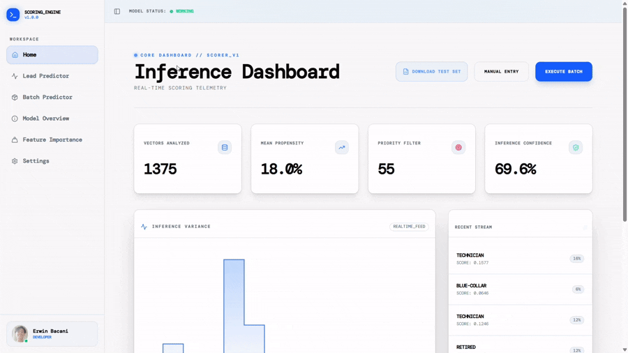
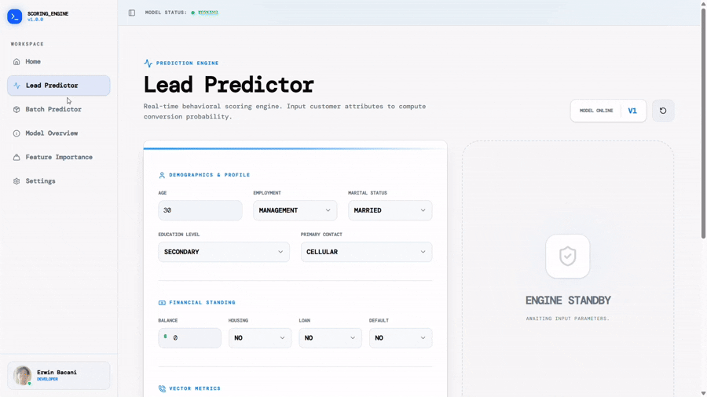
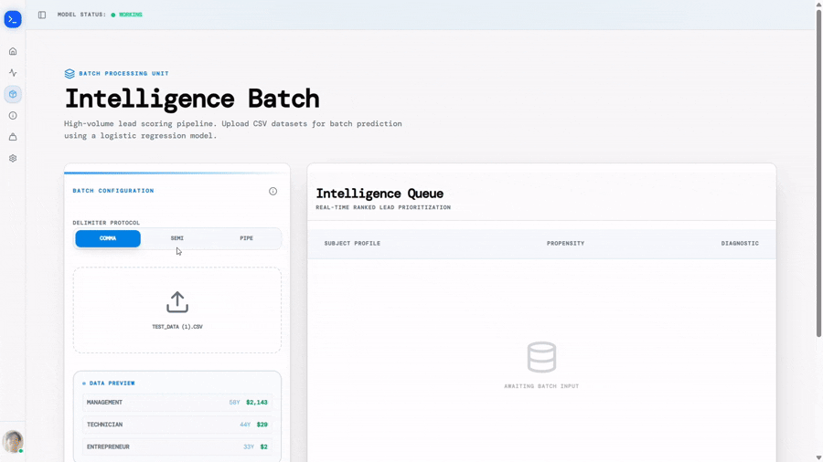
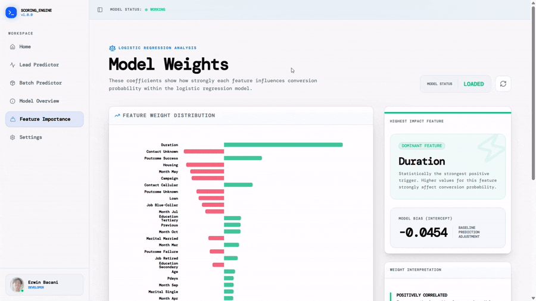
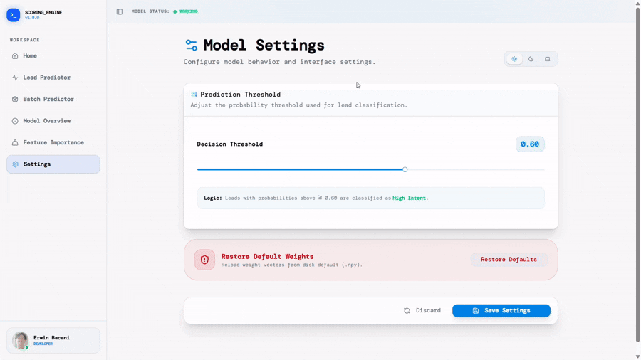

# Lead Intelligence System 🛰️
### Predictive Analytics CRM Powered by Logistic Regression

A full-stack machine learning CRM platform designed to analyze customer behavior, score conversion probability in real time, and provide transparent insight into the mathematical logic behind every prediction.

This system combines a custom-trained Logistic Regression model with a modern telemetry dashboard, enabling both individual and batch lead analysis through an interactive data visualization interface.

---

# 🎬 Demo Showcase

---

## 📡 Intelligence Dashboard



The Intelligence Dashboard provides a real-time overview of model telemetry and conversion analytics.

### Features Demonstrated

- **Vectors Analyzed** — Displays the total number of processed lead vectors.
- **Mean Propensity Score** — Calculates the average conversion probability across all analyzed leads.
- **Priority Lead Detection** — Automatically identifies high-value leads based on scoring thresholds.
- **Inference Confidence Monitoring** — Measures prediction certainty using variance distance from the neutral classification boundary.
- **Distribution Matrix** — Visual breakdown of Low, Warm, and Hot lead categories.
- **Inference Variance Table** — Displays statistical spread and confidence behavior across predictions.

This module acts as the central operational intelligence hub for monitoring model behavior and lead quality in real time.

---

## 🧠 Manual Lead Predictor



The Manual Predictor allows users to input customer telemetry data and receive instant machine learning predictions.

### Features Demonstrated

- Structured lead input form for real-time scoring.
- Instant probability calculation using the Logistic Regression inference engine.
- Dynamic conversion probability output.
- **Recall Functionality** — Users can instantly reload previous lead submissions without manually re-entering data.
- **Prediction History System** — Stores recent inference sessions for rapid comparison and repeated evaluation workflows.

This module focuses on fast interactive inference execution while improving usability through persistent prediction memory.

---

## ⚡ Intelligence Batch Processing



The Batch Intelligence module enables high-speed CSV-based inference processing for large customer datasets.

### Features Demonstrated

- CSV upload support for bulk lead analysis.
- Simultaneous probability scoring for multiple customer records.
- Lead segmentation filters:
  - **All Leads**
  - **Warm Leads**
  - **Hot Leads**
- Deep-dive analytical inspection for each prediction result.
- Transparent explanation system showing why a lead received a high or low score based on feature influence.

This module demonstrates scalable inference execution and explainable AI behavior for enterprise-style analytics workflows.

---

## 📊 Model Weight Visualization



The Model Weights module exposes the internal mathematical behavior of the Logistic Regression model.

### Features Demonstrated

- Feature weight coefficient charts.
- Positive and negative feature influence mapping.
- Highest-impact feature detection.
- Intercept bias visualization.

The demo highlights that **call duration** produces the strongest positive influence on conversion probability, while the model bias represents the baseline prediction offset before feature contributions are applied.

This transparency layer transforms the model from a black-box predictor into an explainable analytics system.

---

## ⚙️ System Settings & Threshold Control



The Settings module provides user-level customization and inference tuning capabilities.

### Features Demonstrated

- Dynamic dark mode theme switching.
- Adjustable prediction threshold configuration.
- Real-time threshold persistence for inference classification behavior.

By modifying the prediction threshold, users can control how aggressively the system classifies leads as Low, Warm, or Hot priority.

This module improves usability while allowing flexible operational calibration depending on business requirements.

---

# 🌐 Live Demo

## Frontend Application
https://lead-scoring-system-maio.onrender.com

## Backend API
https://lead-scoring-system-backend.onrender.com

---

# 🔍 API Health Check

```bash
GET https://lead-scoring-system-backend.onrender.com/health
```

Expected Response:

```json
{
  "status": "healthy",
  "model_loaded": true
}
```
---

# ✨ Features

## 📊 Intelligence Dashboard

A real-time analytics dashboard displaying:

- **Total vectors analyzed** — Live count of processed lead objects.
- **Mean conversion propensity** — Average probability of conversion across the dataset.
- **Priority lead detection** — Automatic filtering of "Hot" leads (Score > 0.7).
- **Model inference confidence** — Statistical certainty based on prediction variance.
- **Distribution matrix visualization** — Breakdown of Low, Mid, and High-priority leads.
- **Recent prediction telemetry stream** — Real-time feed of the latest inferences.

---

## 🧠 Transparent Machine Learning

Unlike traditional “black-box” systems, this platform exposes the internal mathematical behavior of the model.

- **Weight coefficient visualization** — See exactly how each feature affects the score.
- **Bias / intercept analysis** — Understand the model’s base probability offset.
- **Positive vs negative feature influence** — Color-coded indicators for lead drivers and inhibitors.
- **Real-time threshold adjustments** — Dynamic classification based on probability.

---

## ⚡ Dual Inference Modes

### Manual Scoring
Analyze individual leads using a structured telemetry input interface.

### Batch Execution
Upload CSV datasets and execute high-speed bulk inference operations.

---

# 🛠 Technology Stack

| Layer | Technology |
|---|---|
| **Frontend** | Next.js 14+, React, Tailwind CSS, Shadcn UI, Recharts, Lucide React |
| **Backend** | FastAPI, NumPy, Pandas, Pydantic, Uvicorn |
| **Machine Learning** | Custom Logistic Regression, NumPy-based weight persistence |
| **Deployment** | Render |

---

# 🧮 Machine Learning Logic

## 1. Intercept Bias

The model bias represents the base probability offset before any feature contributions are applied.

---

## 2. Feature Weight Influence

### Positive Correlation (Emerald)
Features that increase conversion probability.

Examples:
- Longer call duration
- Successful previous campaign outcomes
- Higher account balance

### Negative Correlation (Rose)
Features that reduce conversion probability.

Examples:
- Loan defaults
- Repeated failed contact attempts
- Poor campaign engagement

---

## 3. Inference Confidence

Model confidence is calculated by measuring prediction distance from the neutral `0.5` threshold.

Higher distance indicates stronger model certainty.

---

# 📂 Project Structure

```bash
lead-intelligence-system/
│
├── model/
│   ├── main.py
│   ├── model_loader.py
│   ├── schema.py
│   ├── requirements.txt
│   ├── weights.npy
│   └── bias.npy
│
├── frontend/
│   ├── app/
│   │   ├── page.tsx
│   │   ├── scorer/
│   │   ├── batch_scorer/
│   │   └── weights/
│   │
│   ├── components/
│   │   └── ui/
│   │
│   ├── public/
│   │   └── test_data.csv
│   │
│   ├── next.config.js
│   ├── package.json
│   └── .env.local
│
└── README.md
```

---

# 🚦 Local Development

## 1. Clone Repository

```bash
git clone https://github.com/Allarezeroes26/Lead-Scoring-System
cd lead-intelligence-system
```

---

# 🔧 Backend Setup

## Install Dependencies

```bash
cd backend
pip install -r requirements.txt
```

## Start FastAPI Server

```bash
uvicorn main:app --reload
```

Backend runs on:

```bash
http://127.0.0.1:8000
```

---

# 🎨 Frontend Setup

## Install Dependencies

```bash
cd frontend
npm install
```

## Configure Environment Variables

Create a file named:

```bash
.env.local
```

Add:

```env
NEXT_PUBLIC_API_URL=http://127.0.0.1:8000
```

## Start Development Server

```bash
npm run dev
```

Frontend runs on:

```bash
http://localhost:3000
```

---

# 🌐 Production Deployment (Render)

## Backend Deployment

### Build Command

```bash
pip install -r requirements.txt
```

### Start Command

```bash
uvicorn main:app --host 0.0.0.0 --port 10000
```

### Environment Variables

```env
ALLOWED_ORIGINS=https://your-frontend.onrender.com
```

---

## Frontend Deployment

### Build Command

```bash
npm install && npm run build
```

### Start Command

```bash
npm start
```

### Environment Variables

```env
NEXT_PUBLIC_API_URL=https://your-backend.onrender.com
```

---

# 📊 Batch Testing

A sample dataset is included at:

```bash
/public/test_data.csv
```

Upload this file into the **Batch Scorer** module to execute simultaneous inference operations and validate telemetry behavior.

---

# 🔍 API Endpoints

| Method | Endpoint | Description |
|---|---|---|
| `GET` | `/health` | Service health check |
| `POST` | `/predict` | Single lead prediction |
| `POST` | `/predict_batch` | Batch lead prediction |
| `GET` | `/weights` | Retrieve model weights |
| `POST` | `/settings/update` | Update inference threshold |
| `POST` | `/settings/reset` | Reset threshold to default |

---

# 📈 Core Concepts

## Logistic Regression

The system uses a custom Logistic Regression implementation to calculate conversion probability using weighted feature contributions.

The final prediction score is derived from:

```math
σ(wx + b)
```

Where:

- `w` = feature weights
- `x` = input vector
- `b` = intercept bias
- `σ` = sigmoid activation function

---

# 📄 License

This project is intended for:

- Educational purposes
- Machine learning experimentation
- Portfolio presentation
- Predictive analytics demonstrations

---

# 👨‍💻 Author

**Erwin Bacani**

GitHub: https://github.com/Allarezeroes26  
LinkedIn: www.linkedin.com/in/john-erwin-bacani-90853a359  
Portfolio: https://portfolio-j0qq.onrender.com/
